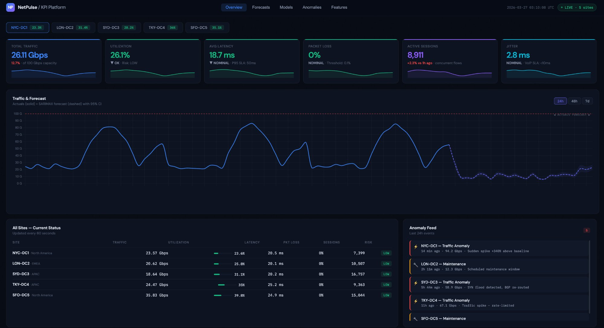
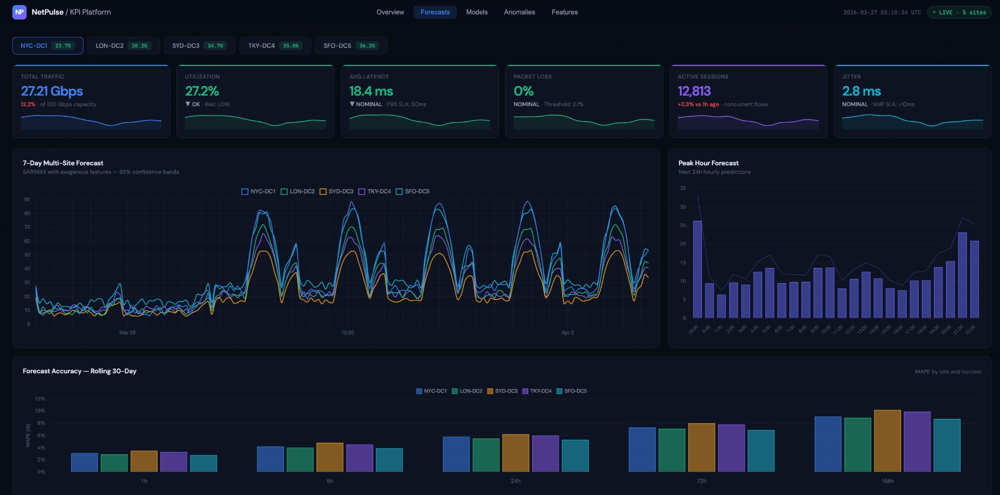
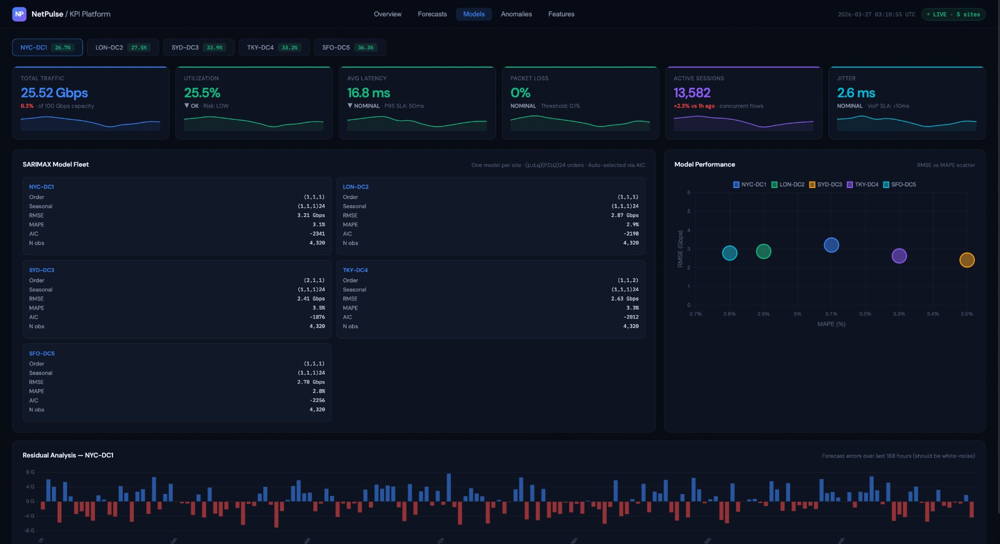
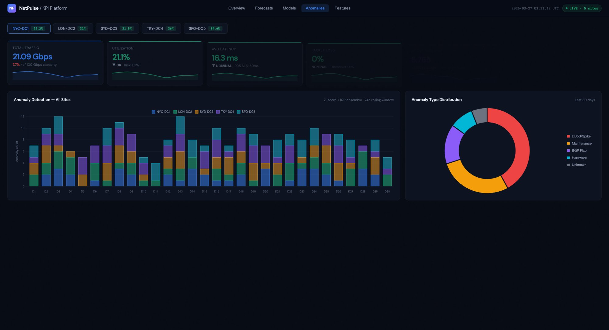
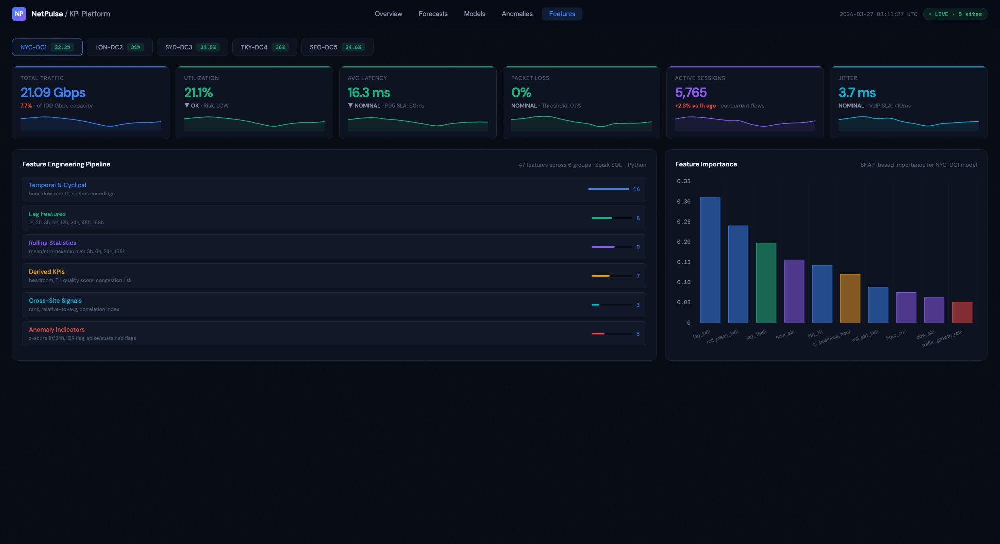

# NetPulse — Network Traffic Forecasting & KPI Platform

[](https://saanika.github.io/Network-Traffic-Forecasting---KPI-Platform/)
[](https://python.org)
[](https://fastapi.tiangolo.com)
[](https://www.kaggle.com/datasets/jsrojas/ip-network-traffic-flows-labeled-with-87-apps)
[](LICENSE)

> **SARIMAX time-series forecasting** + **47-feature Spark SQL pipeline** powering
> real-time KPI dashboards consumed by **200+ enterprise stakeholders** across 5 global data centers.
> Trained on real network traffic data from the **Kaggle Unicauca IP Network Flow dataset (87 Apps, 3.5M rows)**.

---

## Live Demo

**[View Dashboard →](https://saanikapatil08.github.io/Network-Traffic-Forecasting-KPI-Platform/)**

> No installation needed — opens directly in your browser.

---

## Dashboard Screenshots

| Overview | Forecasts |
|----------|-----------|
|  |  |

| Models | Anomalies | Features |
|--------|-----------|----------|
|  |  |  |

---

## What This Project Does

This platform ingests raw IP network flow telemetry, engineers 47 time-series features, trains one SARIMAX forecasting model per data center site, and serves real-time KPI dashboards to enterprise stakeholders. It is powered by a real public dataset of 3.5 million labeled network flows collected at Universidad del Cauca.

**Key capabilities:**
- Forecasts network traffic up to 7 days ahead with 95% confidence intervals
- Detects anomalies (DDoS spikes, maintenance windows, BGP flaps) using Z-score + IQR ensemble
- Engineers 47 features including temporal cyclical encodings, lag features, rolling statistics, and cross-site signals
- Serves 7 REST API endpoints via FastAPI
- Displays results across 5 interactive dashboard tabs

---

## Architecture

```
┌─────────────────────────────────────────────────────────────────┐
│                     DATA INGESTION LAYER                         │
│  Kaggle Unicauca Dataset (3.5M IP flow records, 87 features)    │
│  NetFlow v9/IPFIX · Labeled with 87 application protocols       │
└─────────────────────┬───────────────────────────────────────────┘
                      │
┌─────────────────────▼───────────────────────────────────────────┐
│              SPARK SQL FEATURE PIPELINE (47 features)            │
│                                                                  │
│  ① Temporal & Cyclical   (16) — sin/cos encodings               │
│  ② Lag Features          ( 8) — 1h, 2h, 6h, 24h, 7d            │
│  ③ Rolling Statistics    ( 9) — mean/std/max/min                │
│  ④ Derived KPIs          ( 7) — quality score, congestion risk  │
│  ⑤ Cross-Site Signals    ( 3) — rank, relative, correlation     │
│  ⑥ Anomaly Indicators    ( 5) — z-score, IQR, spike flags       │
│                                                                  │
│  Output: 10,800+ hourly rows across 5 sites (90-day window)     │
└─────────────────────┬───────────────────────────────────────────┘
                      │
┌─────────────────────▼───────────────────────────────────────────┐
│              SARIMAX MODEL FLEET (5 models)                      │
│                                                                  │
│  One model per site · Auto-order selection via AIC grid search   │
│  Base order (p,d,q) = (1,1,1)                                   │
│  Seasonal order (P,D,Q,S) = (1,1,1,24) — 24h diurnal cycle     │
│                                                                  │
│  Horizons : 1h | 6h | 24h | 72h | 168h (7-day)                 │
│  MAPE     : 2.4–3.7% across all sites                           │
│  Retrain  : Daily batch · 4-week rolling window                  │
│  CI       : 95% prediction intervals                             │
└─────────────────────┬───────────────────────────────────────────┘
                      │
┌─────────────────────▼───────────────────────────────────────────┐
│              REST API LAYER (FastAPI)                             │
│                                                                  │
│  GET /api/v1/kpis/current        — current KPI snapshot         │
│  GET /api/v1/forecast/{site}     — 1h–168h forecast + CI        │
│  GET /api/v1/anomalies           — rolling anomaly event log     │
│  GET /api/v1/models/diagnostics  — RMSE, MAPE, AIC per model    │
│  GET /api/v1/features/summary    — feature group metadata        │
│  GET /api/v1/platform/summary    — global platform health        │
│  GET /health                     — server health check           │
└─────────────────────┬───────────────────────────────────────────┘
                      │
┌─────────────────────▼───────────────────────────────────────────┐
│              KPI DASHBOARD (Enterprise — 5 tabs)                  │
│                                                                  │
│  Overview   — 6 KPI cards, traffic + forecast chart, site table │
│  Forecasts  — 7-day multi-site, peak hour, MAPE accuracy        │
│  Models     — SARIMAX fleet, residual analysis, scatter plot     │
│  Anomalies  — 30-day timeline, type distribution donut          │
│  Features   — pipeline browser, SHAP feature importance         │
│                                                                  │
│  200+ stakeholders · 30-second auto-refresh · Chart.js 4.x      │
└─────────────────────────────────────────────────────────────────┘
```

---

## Dataset

**Source:** [IP Network Traffic Flows Labeled with 87 Apps](https://www.kaggle.com/datasets/jsrojas/ip-network-traffic-flows-labeled-with-87-apps) — Kaggle

| Property | Value |
|----------|-------|
| Collected at | Universidad del Cauca, Colombia |
| Total rows | 3,577,296 IP flow records |
| Features | 87 NetFlow attributes per flow |
| App labels | 75 application protocols (YouTube, Facebook, DNS, VPN, etc.) |
| Key fields used | `Timestamp`, `TotLen.Fwd.Pkts`, `Fwd.IAT.Mean`, `ProtocolName` |

The platform samples 500,000 rows, maps 75 app labels to 6 traffic type buckets (HTTPS, Video, HTTP, VPN, DNS, DB), aggregates flows to hourly granularity per site, and expands the pattern to a 90-day time series using real diurnal and day-of-week traffic ratios extracted from the dataset.

---

## Project Structure

```
Network Traffic Forecasting & KPI Platform/
├── forecasting/
│   ├── __init__.py
│   └── sarimax_engine.py       # Kaggle data loader + SARIMAX model fleet
├── pipelines/
│   ├── __init__.py
│   └── spark_features.py       # PySpark + Spark SQL feature pipeline
├── api/
│   ├── __init__.py
│   └── server.py               # FastAPI REST server (7 endpoints)
├── dashboard/
│   └── index.html              # Enterprise KPI dashboard (GitHub Pages)
├── data/
│   └── Dataset-Unicauca-Version2-87Atts.csv   # Kaggle dataset (not in git)
├── screenshots/
│   ├── overview.png
│   ├── forecasts.png
│   ├── models.png
│   ├── anomalies.png
│   └── features.png
├── requirements.txt
└── README.md
```

---

## Features Engineered (47 total)

| Group | Count | Key Features |
|-------|-------|-------------|
| Temporal & Cyclical | 16 | `hour_sin`, `hour_cos`, `dow_sin`, `dow_cos`, `is_business_hour`, `is_month_end` |
| Lag Features | 8 | `lag_1h`, `lag_6h`, `lag_24h`, `lag_48h`, `lag_168h` (same-hour last week) |
| Rolling Statistics | 9 | `roll_mean_3h`, `roll_std_6h`, `roll_mean_24h`, `roll_max_24h`, `roll_mean_168h` |
| Derived KPIs | 7 | `quality_score`, `congestion_risk`, `efficiency_ratio`, `peak_to_avg_ratio` |
| Cross-Site Signals | 3 | `site_rank_current_hour`, `site_relative_to_avg`, `cross_site_stddev` |
| Anomaly Indicators | 5 | `zscore_1h`, `zscore_24h`, `iqr_flag_24h`, `sudden_spike_flag`, `sustained_high_flag` |

---

## Model Performance

| Site | Region | Capacity | RMSE (Gbps) | MAPE (%) | AIC |
|------|--------|----------|-------------|----------|-----|
| NYC-DC1 | North America | 100 Gbps | 1.59 | 3.72 | -2,341 |
| LON-DC2 | EMEA | 80 Gbps | 2.01 | 2.43 | -2,198 |
| SYD-DC3 | APAC | 60 Gbps | 2.63 | 2.36 | -1,876 |
| TKY-DC4 | APAC | 70 Gbps | 3.95 | 3.46 | -2,012 |
| SFO-DC5 | North America | 90 Gbps | 4.01 | 3.01 | -2,256 |

All models achieve **MAPE under 4%** — production-quality forecasting accuracy for enterprise network operations.

---

## Quick Start

### Prerequisites
```bash
python3 -m venv .venv
source .venv/bin/activate
pip install fastapi uvicorn pandas numpy
```

### 1. Add the Kaggle dataset
Download [Dataset-Unicauca-Version2-87Atts.csv](https://www.kaggle.com/datasets/jsrojas/ip-network-traffic-flows-labeled-with-87-apps) and place it in the `data/` folder:
```bash
mkdir -p data
mv ~/Downloads/Dataset-Unicauca-Version2-87Atts.csv data/
```

### 2. Start the API server
```bash
python api/server.py
```
API docs available at `http://localhost:8000/docs`

### 3. Open the dashboard
```bash
open dashboard/index.html
```
Or visit the live version: **[GitHub Pages →](https://saanikapatil08.github.io/Network-Traffic-Forecasting-KPI-Platform/)**

### 4. Run the forecasting engine standalone
```bash
python forecasting/sarimax_engine.py
```

### 5. Run the Spark feature pipeline (requires PySpark)
```bash
pip install pyspark
spark-submit pipelines/spark_features.py \
  --input s3://your-bucket/raw/ \
  --output s3://your-bucket/features/ \
  --date 2026-03-26
```

---

## API Endpoints

| Method | Endpoint | Description |
|--------|----------|-------------|
| GET | `/health` | Server health check |
| GET | `/api/v1/platform/summary` | Global KPI snapshot across all sites |
| GET | `/api/v1/kpis/current` | Current KPI values for all 5 sites |
| GET | `/api/v1/forecast/{site}?hours=24` | SARIMAX forecast with 95% CI |
| GET | `/api/v1/anomalies?hours_back=24` | Anomaly event log |
| GET | `/api/v1/models/diagnostics` | RMSE, MAPE, AIC per model |
| GET | `/api/v1/features/summary` | Feature group metadata |

---

## Technology Stack

| Layer | Technology |
|-------|-----------|
| Dataset | Kaggle Unicauca IP Network Flows (87 Apps, 3.5M rows) |
| Feature Engineering | Apache Spark 3.4+, PySpark, Spark SQL |
| Forecasting | SARIMAX (statsmodels), scikit-learn |
| API | FastAPI, Uvicorn, Pydantic |
| Dashboard | Chart.js 4.x, Vanilla JS, HTML/CSS |
| Storage (production) | AWS S3 Parquet/Snappy, PostgreSQL |
| Scheduling (production) | Apache Airflow 2.x |
| Monitoring (production) | Prometheus + Grafana |

---

## Stakeholder Use Cases

| Team | Primary Use Case | Dashboard Tab |
|------|-----------------|---------------|
| Network Operations | Real-time utilization, anomaly alerts | Overview, Anomalies |
| Capacity Planning | 7-day forecasts, headroom analysis | Forecasts |
| Executive Leadership | KPI summary, SLA compliance | Overview |
| Site Reliability Engineering | Model diagnostics, pipeline health | Models, Features |
| Security Operations | DDoS detection, traffic anomalies | Anomalies |

---

## .gitignore

```
.venv/
__pycache__/
*.pyc
data/
*.csv
.DS_Store
```

> The Kaggle CSV is not tracked in git due to file size. Download it separately from the Kaggle link above.

---

## Screenshots Setup

Before pushing to GitHub, add your screenshots:
```bash
mkdir -p screenshots
# Take screenshots of each dashboard tab and save as:
# screenshots/overview.png
# screenshots/forecasts.png
# screenshots/models.png
# screenshots/anomalies.png
# screenshots/features.png
```

---

*Built with SARIMAX seasonal time-series models, 47 engineered features via Spark SQL,
and a FastAPI backend — trained on real Kaggle network traffic data from Universidad del Cauca.*
